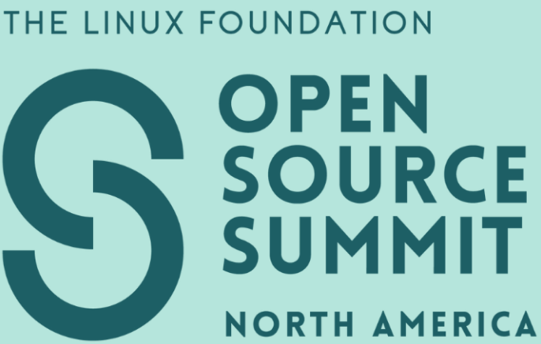

<!-- .slide: data-background-color="#b5e5dc" style="height: 100%;" -->


<div style="height: 100%; display: flex; flex-direction: column; justify-content: space-between; margin-left: 10px; margin-right: 10px;">

<div>
<h3>Efficient On-Device Core Dump Processing for IoT: A Rusty Implementation</h3>
<h4>Blake Hildebrand</h4>
</div>

<div style="display: flex;  align-items: baseline; gap:20px;">
  
  <small>#OSSummit</small>
  <small>@bahildebrand</small>
</div>

</div>

---

<!-- .slide: data-background-color="#f2a541" -->

<div style="display: flex; margin: 20px;">
<div style="display: flex; flex-shrink:2; flex-direction:column;margin-right: 50px;">
 
</div>

<pre style="align-self: center;"><code data-line-numbers="1|3-7|9-15|17-20" class="language-bash">> readelf -n blake.elf

Displaying notes found in: oss.host
Owner                Data size        Description
Blake                0x00000010       YOUR_HOST
  Your host: Blake Hildebrand - @bahildebrand
  Job title: Software Engineer @Memfault

Displaying notes found in: blake.experience
Owner                Data size        Description
Blake                0x00000034       WORK_EXPERIENCE
  microcontrollers
  embedded linux
  backend - distributed systems
  Garmin - Amazon Robotics - AWS

Displaying notes found in: blake.current-gig
Owner                Data size        Description
Blake                0x00000005       CURRENT_GIG
  Develop memfaultd and help embedded engineers ship faster
</code>
</pre>
</div>

---

## Stages of Coredump Collection Development

<ol>
<li class="fragment fade-up">Normal Core Passthrough</li>
  <ul class="fragment fade-up">
    <li>Setting the stage for future improvements</li>
    <li>Allow for added metadata</li>
  </ul>
<li class="fragment fade-up">Stack Only</li>
  <ul class="fragment fade-up">
    <li>Shrinks the size</li>
  </ul>
<li class="fragment fade-up">On-Device Unwind</li>
  <ul class="fragment fade-up">
    <li>Prevents PII from leaving the device</li>
    <li>Makes the core even smaller</li>
</ol>

---

## What is a Linux Coredump?

--

A Linux coredump represents a **snapshot** of the crashing process' memory

- Written as an **ELF file**
- Can be loaded into programs like **GDB**
- Inspects the state of the process at the time of crash

--

<!-- .slide: data-auto-animate -->

```c
gdb memfaultd core.elf
```
<!-- .element: data-id="1" -->

--

<!-- .slide: data-auto-animate -->

```c
gdb memfaultd core.elf

(gdb) bt
#0  core::ptr::write<i32> ...
#1  core::ptr::mut_ptr::{impl#0}::write<i32> ...
#2  memfaultd::cli::memfaultctl::coredump::trigger_crash ..
```
<!-- .element: data-id="1" -->

---

## Complete Signal List

The signals that cause a coredump:

- `SIGABRT`: Abnormal termination (abort call)
- `SIGBUS`: Bus error (bad memory access)
- `SIGFPE`: Floating-point exception
- `SIGILL`: Illegal instruction
- `SIGQUIT`: Quit from keyboard
- `SIGSEGV`: Invalid memory reference
- `SIGSYS`: Bad system call
- `SIGTRAP`: Trace/breakpoint trap

---

## Enabling Coredumps

--

### Kernel Configuration

```c
CONFIG_COREDUMP=y
CONFIG_CORE_DUMP_DEFAULT_ELF_HEADERS=y
```

Most distros enable these by default

--

### Set Resource Limits

```bash
ulimit -c unlimited
```

Sets the maximum size of a coredump

---

## `core_pattern` Configuration

--

### Write to File

```bash
/tmp/core.%e.%p
```

- `%e` = process name
- `%p` = process PID

--

### Pipe to Program

```bash
|/usr/sbin/memfault-core-handler -c /etc/memfaultd.conf %P %I %s
```

- Stream coredump via `stdin`
- Access to crashing process' `procfs`
- More flexible processing

---

## ELF Core File Layout

--

### High-Level View

```text
┌─────────────────┐
│   ELF Header    │
├─────────────────┤
│ Program Headers │
├─────────────────┤
│   PT_NOTE 1     │
│   PT_NOTE 2     │
│      ...        │
├─────────────────┤
│   PT_LOAD 1     │ ← Stack Memory
│   PT_LOAD 2     │ ← Heap Memory
│      ...        │ ← Other Segments
└─────────────────┘
```

--

### Two Main Types

- **`PT_NOTE`**: Metadata about the process
- **`PT_LOAD`**: Memory segments (stack, heap, etc.)

---

## PT_NOTE Layout

```text
┌──────────────────────────────────-┐
│ namesz (4 bytes) │ descsz(4 bytes)│
├──────────────────┼────────────────┤
│          type (4 bytes)           │
├───────────────────────────────────┤
│              name                 │
│         (null-terminated)         │
├───────────────────────────────────┤
│              desc                 │
│         (note data)               │
└───────────────────────────────────┘
```

- **namesz/descsz**: Size of name and descriptor
- **name**: String identifying note type
- **desc**: Actual note data
- **type**: Note type identifier

---

<!-- .slide: data-background-color="#b5e5dc" -->
## Coredumps at Memfault: Rev. 1

--

### Goals

- Symbolicated backtrace for each thread
- Register values at crash time
- Symbolicated local variables at each frame
- **No source modifications required**

--

### Our Approach

1. Use existing Linux coredump system
2. Add metadata via custom `PT_NOTE` segment
3. Stream memory to avoid allocations
4. Maintain compatibility with standard tools

---

### Processing Steps

1. Read all program headers into memory
2. Save all `PT_NOTE` segments
3. Stream `PT_LOAD` segments from `/proc/<pid>/mem`
4. Add custom metadata note
5. Write modified ELF coredump

---

## Modified ELF Layout

### Before vs After

```text
Original ELF Core        Modified ELF Core
┌─────────────────┐     ┌─────────────────┐
│   ELF Header    │     │   ELF Header    │
├─────────────────┤     ├─────────────────┤
│ Program Headers │     │ Program Headers │
├─────────────────┤     ├─────────────────┤
│   PT_NOTE       │     │   PT_NOTE       │
│                 │ --> │ + Custom Note   │ ← Added
├─────────────────┤     ├─────────────────┤
│   PT_LOAD       │     │   PT_LOAD       │
│   (Memory)      │     │   (Memory)      │
└─────────────────┘     └─────────────────┘
```

Only difference: Added custom metadata note

---

## Why This Approach?

--

### Benefits

- **Metadata injection**: Device identification and versioning
- **Future flexibility**: Sets stage for advanced processing
- **Memory efficiency**: Streaming prevents large allocations
- **Compatibility**: Standard ELF format works with existing tools

--

### The Problem

**Coredumps can be quite large!**

- Processes with many threads
- Large memory allocations
- Problematic for embedded devices with limited storage

---

<!-- .slide: data-background-color="#27130c" -->

## Rev 1.5: Crabbing It Up


--

### Why Move To Rust?

<!-- .slide: data-background-color="#27130c" -->

<ul class="crab-bullets">
  <li class="fragment fade-up">Memory Safety</li>
  <li class="fragment fade-up">Extensive Ecosystem</li>
  <li class="fragment fade-up">Ergonomics</li>
  <li class="fragment fade-up">Because All The Cool Kids Are Doing it</li>
</ul>

--

<!-- .slide: data-background-color="#27130c" -->

### Fun With Generics

```rust
pub struct CoreTransformer<R, W, P, M>
where
    R: CoreReader,
    W: CoreWriter,
    P: Read + Seek,
    M: ProcMaps,
{
    core_reader: R,
    core_writer: W,
    proc_mem_stream: P,
    metadata: CoredumpMetadata,
    options: CoreTransformerOptions,
    proc_maps: M,
    log_fetcher: CoreTransformerLogFetcher,
}
```

--

### Our Most Used Libraries

<!-- .slide: data-background-color="#27130c" -->

<ul class="crab-bullets">
  <li>clap - CLI Managemnt</li>
  <li>gimli - DWARF Processing</li>
  <li>goblin - ELF Processing</li>
  <li>And much more!</li>
</ul>

---

<!-- .slide: data-background-color="#b5e5dc" -->

## Rev 2: Stack Only

--

### Storage Constraints in Embedded Linux

- Limited storage space
- Need to reserve disk space for other data
- Want to limit writes to flash memory
- Multiple coredumps may be needed

--

### Solution: Strip to Essentials

Keep only what's needed for debugging:

- Stack traces
- Register values
- Local variables on the stack

---

## Defining The Minimum Coredump

--

### Requirements for Slim Coredump

1. **Limit each stack** to the top N bytes
2. **Remove heap allocations** completely
3. **Capture metadata** needed for debuggers

--

### Tradeoffs

**Lost capabilities:**

- No heap-allocated values
- Limited stack depth

**Acceptable because:**

- Most crashes debuggable with stack trace alone
- Most stacks aren't very deep
- Top few frames usually most interesting

---

## Finding The Stacks

--

### The Challenge

- Need to find `PT_LOAD` segments containing stacks
- Requires knowing each thread's Program Counter (PC)
- Must limit capture to top N bytes per stack

--

### Solution: `NT_PRSTATUS` Notes

```c
struct elf_prstatus {
  struct elf_prstatus_common common;
  elf_gregset_t pr_reg; /* GP registers */
  int pr_fpvalid;
};
```

Contains all general purpose registers at crash time

--

### Finding Stack Regions

1. Extract `SP` from `pr_reg` for each thread
2. Search `/proc/<pid>/maps` for matching memory ranges
3. Copy from `SP` down to start of stack (max N bytes)

```bash
> cat /proc/1234/maps
00430000-00873000 r-xp 00000000 b3:02 3172  /usr/bin/memfaultd
00882000-008bd000 r--p 00442000 b3:02 3172  /usr/bin/memfaultd
```

---

## Debug Information Requirements

--

### Problem: Dynamic Linking

- Programs use shared libraries (`libopenssl`, etc.)
- Address Space Layout Randomization (ASLR)
- Need mapping: compile-time → runtime addresses

--

### Solution: `r_debug` Structure

```c
struct r_debug {
  int r_version;
  struct link_map *r_map; /* Head of loaded objects */
  ElfW(Addr) r_brk;
  /* ... */
};

struct link_map {
  ElfW(Addr) l_addr;    /* Address difference */
  char *l_name;         /* File name */
  struct link_map *l_next, *l_prev;
};
```

---

## Finding `r_debug`

--

### `PT_DYNAMIC` Program Header

```c
typedef struct {
  Elf64_Sxword d_tag;
  union {
    Elf64_Xword d_val;
    Elf64_Addr  d_ptr;
  } d_un;
} Elf64_Dyn;
```

--

### Process

1. Find `PT_DYNAMIC` segment
2. Iterate through dynamic tags
3. Look for `DT_DEBUG` tag
4. Extract `r_debug` structure
5. Add memory range to coredump

---

## Metadata Collection

--

### Required for Each Mapped File

1. **ELF header**
2. **All program headers**
3. **Build ID note**

Enables GDB to fetch symbols for dynamic libraries

--

### Discovery Process

- Parse `/proc/<pid>/maps` for all mapped ELF files
- Extract metadata from each mapped library
- Include in final coredump

---

## Size Savings Results

--

### Before: Traditional Coredump

```bash
ls -la core-original.elf
-rw-r--r-- 1 root root 2625K core-original.elf
```

**2.6 MB** - Very large for embedded devices!

--

### After: Optimized Coredump

```bash
ls -la core-optimized.elf
-rw-r--r-- 1 root root 75K core-optimized.elf
```

**75 KB** - **35x size reduction!**

--

### Impact

- Can store multiple coredumps in space of one original
- Significant savings on constrained devices
- Still maintains full debugging capability
- Varies by program, but consistently dramatic

---

<!-- .slide: data-background-color="#b5e5dc" -->

## Rev 3: On-Device Unwinding

--

### The Ultimate Goals

1. **Privacy**: No sensitive customer data leaves the device
2. **Size**: Even greater reduction than Part 2
3. **Security**: No memory sections transmitted

--

TODO: Add slide reiterate what we're trying to get to, show a stacktrace

--

### The Approach

Strip away ALL captured memory and do stack unwinding on-device

**Result**: Send only Program Counters (PCs) and metadata

---

## What Information Do We Need?

--

### Minimum Requirements

- **PC (Program Counter)** for each frame
- **Symbol information** for each binary:
  - PC range
  - GNU build ID
  - Compile-time vs runtime offset (ASLR)
  - File path

--

### ASLR Challenge

**Address Space Layout Randomization** randomizes load addresses

- Security feature prevents exploitation
- Compile-time addresses ≠ Runtime addresses
- Need mapping between the two

---

## JSON Structure Example

```json
{
  "symbols": [
    {
      "pc_range": { "start": "0x555dbc0000", "end": "0x555dc4c000" },
      "build_id": "4929ac8cb3c174c113cafc7250efe12eee45cd25",
      "compiled_offset": "0x0",
      "runtime_offset": "0x555dbc0000",
      "path": "/usr/bin/memfaultd"
    }
  ],
  "threads": [
    {
      "pcs": [ "0x7f95862508", "0x7f95894b80" ]
    }
  ]
}
```

---

## Symbolication Process

For each PC in a thread:

1. **Find symbols** by checking PC ranges
2. **Fetch symbol file** by build ID or path
3. **Adjust for ASLR**:
   - Subtract runtime offset
   - Add compiled offset
4. **Run through `addr2line`** for symbolification

---

## GNU Unwind Information

--

### Frame Pointer Limitations

- Frame pointer not always available
- Some platforms don't have frame pointers
- Compilers may optimize away frame pointers
- How do we find previous frame structure?

--

### The Solution: `.eh_frame`

Modern compilers include `.eh_frame` section:

- Contains rules to rebuild frame information
- Works without frame pointers
- Provides register locations on stack
- Enables traversal to previous frames

---

## `.eh_frame` Structure

--

### Key Components

- **CFI**: Common Frame Information
- **CIE**: Common Information Entry (shared rules)
- **FDE**: Frame Description Entry (specific rules)
- **CFA**: Canonical Frame Address (frame base)

--

### Example Output

```bash
00000000 0000000000000014 00000000 CIE
  Version:               1
  Augmentation:          "zR"
  Code alignment factor: 1
  Data alignment factor: -8
  Return address column: 16
  DW_CFA_def_cfa: r7 (rsp) ofs 8
  DW_CFA_offset: r16 (rip) at cfa-8
```

---

## Frame Reconstruction

--

### CFA Calculation

```bash
DW_CFA_def_cfa: r7 (rsp) ofs 8
```

CFA = RSP + 8

--

### Register Recovery

```bash
DW_CFA_offset: r16 (rip) at cfa-8
```

RIP = CFA - 8

--

### Visual Representation

```text
Stack Layout:
┌─────────────┐ ← RSP
│             │
├─────────────┤ ← CFA (RSP + 8)
│ Return Addr │ ← RIP (CFA - 8)
├─────────────┤
│ Saved Regs  │
└─────────────┘
```

---

## Grabbing Thread Information

--

### Register State Source

**`NT_PRSTATUS` ELF notes** contain:

- Current GP registers for each thread
- State at time of crash
- Starting point for unwinding

--

### Binary Mapping Source

**`/proc/<pid>/maps`** provides:

```bash
00430000-00873000 r-xp 00000000 b3:02 3172  /usr/bin/memfaultd
00882000-008bd000 r--p 00442000 b3:02 3172  /usr/bin/memfaultd
b6c70000-b6c76000 r-xp 00000000 b3:02 544   /lib/libcap.so.2.66
```

- Runtime address ranges
- Permission flags (`x` = executable)
- File paths for symbols

---

## Information Extraction

--

### From Each Binary

1. **`.eh_frame`** / **`.eh_frame_hdr`** sections
2. **`.note.gnu.build-id`** for identification
3. **Runtime vs compile-time offset** calculation

--

### Assembly Process

✅ GP registers from `prstatus` notes

✅ Binary/dynamic lib address ranges

✅ Runtime offsets from `/proc/<pid>/maps`

✅ Binary paths for symbol files

✅ Unwind information from `.eh_frame`

✅ Build IDs for symbol matching

---

## Tying It All Together

--

### Complete Output Example

From `memfaultctl trigger-coredump`:

```json
{
  "version": "1",
  "signal": "SIGSEGV",
  "cmdline": "memfaultctl\u0000trigger-coredump\u0000",
  "symbols": [
    {
      "pc_range": {
        "start": "0x55ea82cc4000",
        "end": "0x55ea839d3000"
      },
      "build_id": "4dfbaf904988c2cf8277f93d7adbf183884f8ed0",
      "compiled_offset": "0x1bd000",
      "runtime_offset": "0x55ea82cc4000",
      "path": "/home/blake/memfaultd/target/debug/memfaultd"
    }
  ]
}
```

--

### Stack Trace Data

```json
{
  "threads": [
    {
      "active": true,
      "pcs": [
        "0x55ea82cff77c",
        "0x55ea82cff4a7",
        "0x55ea82cff46f",
        "0x55ea82e2e73f",
        ...
      ]
    }
  ]
}
```

--

## Address Resolution Process

--

### Step 1: Identify the Binary

Top of stack: `0x55ea82cff77c`

Binary address range:

```json
"pc_range": {
  "start": "0x55ea82cc4000",
  "end": "0x55ea839d3000"
}
```

✅ Address fits in range → it's in `memfaultd`

--

### Step 2: Calculate Relative Address

Account for ASLR shift:

```json
"compiled_offset": "0x1bd000",
"runtime_offset": "0x55ea82cc4000"
```

**Formula:** `address - runtime_offset + compiled_offset`

**Result:** `0x55ea82cff77c - 0x55ea82cc4000 + 0x1bd000 = 0x1f877c`

--

### Step 3: Resolve Symbol

```bash
$ addr2line -Cf -e memfaultd 1f877c
core::ptr::write
/rustc/.../library/core/src/ptr/mod.rs:1377
```

🎯 **Found the crash!** NULL pointer write as expected

--

### Complete Stack Trace

Repeat this process for **each address** in the stack:

1. **Identify** which binary contains the address
2. **Calculate** the relative address
3. **Resolve** the symbol with `addr2line`
4. **Build** the complete call stack

**Result:** Full symbolic stack trace without exposing memory!

---

## Benefits Summary

--

### Privacy Advantages

- **Zero memory sections** leave the device
- **No heap data** transmitted
- **No stack variables** sent
- **Only PCs and metadata** shared

--

### Size Advantages

- **Minimal data**: Just addresses and symbols
- **Predictable size**: Not dependent on memory usage
- **Even smaller** than Part 2's 35x reduction
- **Constant overhead** per thread

---

## Conclusion

- **Traditional coredumps:** Powerful but large
- **Stack Only Coredumps** Significantly reduced size by stripping heap and limiting stack depth.
  - ~35x size reduction.
- **On-Device Unwinding:** The ultimate solution for privacy and size.
  - Only program counters (PCs) and necessary metadata are collected.
  - Leverages `.eh_frame` and `addr2line` for local stack unwinding.
- **Result:** Efficient, privacy-preserving crash capture for embedded Linux IoT devices.

---

## Q&A

<div style="display: flex; margin: 20px; align-items: flex-start;">
<div style="flex: 1; margin-right: 50px;">
<ul>
<li><b>Source Code:</b> <a href="https://github.com/memfault/memfaultd/tree/main/memfaultd/src/cli/memfault_core_handler/stack_unwinder">memfault/memfaultd</a></li>
<li>Join our rooftop Happy Hour tonight, 6:30-8:00pm, right after the Tux Trek. Just across the street @ 54thirty Rooftop (1475 California St).</li>
</ul>
</div>

<div style="flex-shrink: 0;">

</div>
</div>
